# Traffic Sign Recognition Project

Second project of the Udacity nanodegree program is the task to build traffic sign recognizer in tensorflow.
To complete the project, we need to meet following goals:

* Load the data set of German traffic signs
* Explore, summarize and visualize the data set
* Design, train and test a model architecture
* Use the model to make predictions on new images
* Analyze the softmax probabilities of the new images
* Summarize the results with a written report

---

[//]: # (Image References)

[image1]: ./examples/05050.ppm "pic1"
[image2]: ./examples/05650.ppm "pic2"
[image3]: ./examples/07142.ppm "pic3"
[image4]: ./examples/09028.ppm "pic4"
[image5]: ./examples/11721.ppm "pic5"
[image6]: ./new_images/g3.png "pic6"
[image7]: ./new_images/g4.png "pic7"
[image8]: ./new_images/g5.png "pic8"
[image9]: ./new_images/g7.png "pic9"
[image10]: ./new_images/g8.png "pic10"
[image11]: ./graph.png "graph"
[image12]: ./histogram.png "histogram"
[image13]: ./equalized.png "equalized"

# 1. Data Set Summary & Exploration

I used the pandas library to calculate summary statistics of the traffic
signs data set:

* The shape of a traffic sign image is (32, 32, 3)
* The size of whole data set is 39209
* The size of train data set is 31328 ( 80% of the whole )
* The size of the validation set is 7881 ( 20% of the whole )
* The size of test set is 12630
* The number of unique classes/labels in the data set is 43

![data-histogram][image12]

Update: I also tried to all flip images (left <--> right) before random shuffle and add them to the original dataset, it indeed improved accuracy to 99%. But we still have 75% accuracy for real world case.

# 2. Data augmentation
I decided to convert images to grayscale with one channel because it will reduce the number of parameters. So the image shape is now (32, 32, 1). Here is an example of a traffic sign image before and after grayscaling.
As a second step, I decided to normalize images because it should help optimizer to converge better. 
The difference between the original data set and the augmented data set is that processed images have only one channel and are normalized as: -1 < pix < 1. I also tried adaptive histrogram equalization, but I was unable to make it work correctly and pictures was worse than better, so I left it without it. 

Example of "equalized" picture 
![equalized][image13]

# 3. Neural Network Architecture

I used standard LeNet architecture and received decent score over 80% accuracy. But network started to show overfitting and also training was rather slow. In second iteration, I changed RELU to ELU, hopping to perform [better](https://www.picalike.com/blog/2015/11/28/relu-was-yesterday-tomorrow-comes-elu/) . I also added dropout layers after first and second convolution, just before elu activation. As the last thing, I dropped learning rate and let it on the Adam optimizer itself. 

My upgraded LeNet model consisted of the following layers:

| Layer         		|     Description	        					| 
|:---------------------:|:---------------------------------------------:| 
| Input         		| 32x32x1 RGB image   							| 
| Convolution 5x5     	| 1x1 stride, same padding, outputs 28x28x6  	|
| Dropout           	| 50% dropout chance                        	|
| ELU					|												|
| Max pooling	      	| 2x2 stride,  outputs 14x14x6  				|
| Convolution 5x5     	| 1x1 stride, valid padding, outputs 32x32x64 	|
| Dropout           	| 50% dropout chance                        	|
| ELU					|												|
| Max pooling	      	| 2x2 stride,  outputs 16x16x64 				|
| Flatten       	    | Input 100, Output 400       					|
| Fully connected		| Input 400, Output 120       					|
| ELU		    		|           									|
| Fully connected		| Input 120, Output 84        					|
| ELU		    		|           									|
| Fully connected		| Input 84, Output 43        					|

Graph visualisation from Tensorboard:
![graph][image11]

# 4. Training phases and finding solution

In first iteration, I used pure LeNet architecture. I used Adam optimizer with learning rate of 1e-5. I trained it on old macbook pro. I used batch size of 64 pictures. As expected, results were not good enought. I schieved accuracy under 80%. 

In second iteration, I tried to change some parameters. First, I let Adam Optimizer with default learning rate ( 1e-3 ). I added two dropout layers and increased batch size to 256. It helped me achieved needed accuracy in under 25 epochs. After those improvements, I was satisfied with the results. 

I also saved trained model only when validation accuracy improved. If model did not improved for over 50 epochs, training automatically stops.

# 5. Validation Results

My final model results were:
* training set accuracy of 97.0+ %
* validation set accuracy of 97.0+ % 
* test set accuracy of 86.7%

# 6. "Real world" results
Instead of just five, I downloaded twelve images from Google's Street view. Some images are same, but photographed from different angle or in different light settings.
All images have been captured from area around Berlin. 

Here are few German traffic signs that I got:

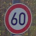
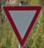
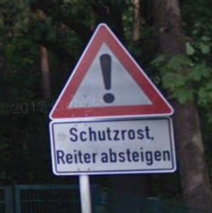
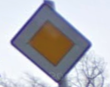
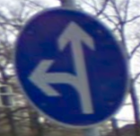
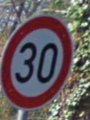
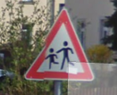
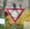
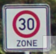
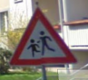
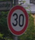
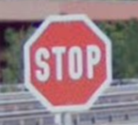

 

So I preprocessed new images and run inference. I received fine results with the accuracy of 75%.

| Image			      				|     Prediction	        		| 
|:---------------------------------:|:---------------------------------:| 
| Speed limit (60km/h)      		| Speed limit (60km/h)   			| 
| Yield     						| Yield								|
| Speed limit (30km/h)				| Keep right						|
| Children crossing		      		| Children crossing					|
| Children crossing					| General caution					|
| Speed limit (30km/h) 	 			| Speed limit (120km/h)				|
| Stop 								| Stop 								|
| Priority road 					| Priority road 					|
| Yield 							| Yield								|
| Speed limit (30km/h) 				| Speed limit (30km/h) 				|
| Go straight or left 				| Go straight or left 				|
| General caution 					| General caution 					|

The model was able to correctly guess 9 of the 12 traffic signs, which gives an accuracy of 75%. 

The top five soft max probabilities are :

------------------- Speed limit (60km/h) ------------ 
100.000 % 
0.000 % 
0.000 % 
0.000 % 
0.000 % 
------------------- Yield --------------------------- 
100.000 % 
0.000 % 
0.000 % 
0.000 % 
0.000 % 
------------------- Keep right ---------------------- 
85.343 % 
6.050 % 
5.667 % 
1.717 % 
0.996 % 
------------------- Children crossing --------------- 
99.558 % 
0.442 % 
0.000 % 
0.000 % 
0.000 % 
-------------------- General caution ---------------- 
99.510 % 
0.193 % 
0.173 % 
0.046 % 
0.031 % 
-------------------- Speed limit (120km/h) ---------- 
58.283 % 
20.547 % 
19.286 % 
1.469 % 
0.394 % 
-------------------- Stop --------------------------- 
100.000 % 
0.000 % 
0.000 % 
0.000 % 
0.000 % 
-------------------- Priority road ------------------ 
100.000 % 
0.000 % 
0.000 % 
0.000 % 
0.000 % 
-------------------- Yield --------------------------- 
100.000 % 
0.000 % 
0.000 % 
0.000 % 
0.000 % 
-------------------- Speed limit (30km/h) ------------ 
100.000 % 
0.000 % 
0.000 % 
0.000 % 
0.000 % 
-------------------- Go straight or left ------------- 
100.000 % 
0.000 % 
0.000 % 
0.000 % 
0.000 % 
-------------------- General caution ----------------- 
88.069 % 
10.930 % 
0.858 % 
0.124 % 
0.008 % 
 

It is shown that models is very certain of its results in correct cases. Unfortunatelly, model is certain even with uncorrect prediction ( except speed limit 30 km/h, there is 58% reliability ). As expected, model interchanged correct in cases when picture was deformed or in not so favorable lightning conditions. Uncorect predictions are somewhat similar in shape of the sign or the image in the sign. For example general caution and children crossing have very similar shapes. Same is true for speed limit 30 km/h and 120 km/h. 

# 7. Discussion of possible improvements
We had a problem to differentiate between Pedestrians and General caution traffic sign. One of the problems could be that the are not enough data for Pedestrians images. Possible improvement could be to use generative adversial network to generate order of magnite more images. In this case, cnn could have enough data to generalize better. We could also try to use not normal grayscale conversion, but use HLS channels to get better results for different lightning settings. Final improvement will be to use VGG network or some other advanced architecture.