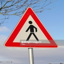
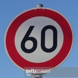

# Traffic Sign Recognition Project

Second project of the Udacity nanodegree program is the task to build traffic sign recognizer in tensorflow.
To complete the project, we need to meet following goals:

* Load the data set of German traffic signs
* Explore, summarize and visualize the data set
* Design, train and test a model architecture
* Use the model to make predictions on new images
* Analyze the softmax probabilities of the new images
* Summarize the results with a written report

---

[//]: # (Image References)

[image1]: ./examples/05050.ppm "pic1"
[image2]: ./examples/05650.ppm "pic2"
[image3]: ./examples/07142.ppm "pic3"
[image4]: ./examples/09028.ppm "pic4"
[image5]: ./examples/11721.ppm "pic5"
[image6]: ./new_images/g1.jpg "pic6"
[image7]: ./new_images/g2.jpg "pic7"
[image8]: ./new_images/g3.jpg "pic8"
[image9]: ./new_images/g4.jpg "pic9"
[image10]: ./new_images/g5.jpg "pic10"
[image11]: ./graph.png "graph"
[image12]: ./histogram.png "histogram"
[image13]: ./equalized.png "equalized"

# 1. Data Set Summary & Exploration

I used the pandas library to calculate summary statistics of the traffic
signs data set:

* The shape of a traffic sign image is (32, 32, 3)
* The size of whole data set is 39209
* The size of train data set is 31328 ( 80% of the whole )
* The size of the validation set is 7881 ( 20% of the whole )
* The size of test set is 12630
* The number of unique classes/labels in the data set is 43

![data-histogram][image12]

Update: I also tried to all flip images (left <--> right) before random shuffle and add them to the original dataset, it indeed improved accuracy to 99%. But we still have 80% accuracy for real world case.

# 2. Data augmentation
I decided to convert images to grayscale with one channel because it will reduce the number of parameters. So the image shape is now (32, 32, 1). Here is an example of a traffic sign image before and after grayscaling.
As a second step, I decided to normalize images because it should help optimizer to converge better. 
The difference between the original data set and the augmented data set is that processed images have only one channel and are normalized as: -1 < pix < 1. I also tried adaptive histrogram equalization, but I was unable to make it work correctly and pictures was worse than better, so I left it without it. 

Example of "equalized" picture 
![equalized][image13]

# 3. Neural Network Architecture

I used standard LeNet architecture and received decent score over 80% accuracy. But network started to show overfitting and also training was rather slow. In second iteration, I changed RELU to ELU, hopping to perform [better](https://www.picalike.com/blog/2015/11/28/relu-was-yesterday-tomorrow-comes-elu/) . I also added dropout layers after first and second convolution, just before elu activation. As the last thing, I dropped learning rate and let it on the Adam optimizer itself. I also increased batch from 64 to 256. Main improvement was not in the architecture itself, but because I used new GTX1080ti and was able to run more iterations quickly. After those improvements, I was satisfied with the results.

My upgraded LeNet model consisted of the following layers:

| Layer         		|     Description	        					| 
|:---------------------:|:---------------------------------------------:| 
| Input         		| 32x32x1 RGB image   							| 
| Convolution 3x3     	| 1x1 stride, same padding, outputs 28x28x6  	|
| Dropout           	| 50% dropout chance                        	|
| ELU					|												|
| Max pooling	      	| 2x2 stride,  outputs 14x14x6  				|
| Convolution 3x3     	| 1x1 stride, valid padding, outputs 32x32x64 	|
| Dropout           	| 50% dropout chance                        	|
| ELU					|												|
| Max pooling	      	| 2x2 stride,  outputs 16x16x64 				|
| Flatten       	    | Input 100, Output 400       					|
| Fully connected		| Input 400, Output 120       					|
| ELU		    		|           									|
| Fully connected		| Input 120, Output 84        					|
| ELU		    		|           									|
| Fully connected		| Input 84, Output 43        					|

Graph visualisation from Tensorboard:
![graph][image11]

# 4. Validation Results

My final model results were:
* training set accuracy of 97.0+ %
* validation set accuracy of 97.0+ % 
* test set accuracy of 86.7%

# 5. "Real world" results

Here are five German traffic signs that I found on the web:

So I preprocessed new images and run inference. I received fine results with the accuracy of 80%.

| Image			        |     Prediction	        					| 
|:---------------------:|:---------------------------------------------:| 
| Road Work      		| Road Work   									| 
| Pedestrians     		| General caution								|
| General caution		| General caution								|
| Stop		      		| Stop							 				|
| Speed limit (60km/h)	| Speed limit (60km/h)							|

The model was able to correctly guess 4 of the 5 traffic signs, which gives an accuracy of 80%. This compares fine, since we tried just few images, so each error have significant value.

The top five soft max probabilities are :

Image number: 1
100.000 %
0.000 %
0.000 %
0.000 %
0.000 %
---------------------------------------- 
Image number: 2
99.397 %
0.587 %
0.012 %
0.003 %
0.001 %
---------------------------------------- 
Image number: 3
99.607 %
0.390 %
0.003 %
0.000 %
0.000 %
----------------------------------------
Image number: 4
100.000 %
0.000 %
0.000 %
0.000 %
0.000 %
---------------------------------------- 
Image number: 5
100.000 %
0.000 %
0.000 %
0.000 %
0.000 %
---------------------------------------- 

It is shown that models is very certain of its results. Unfortunatelly, model is certain that Pedestrians sign is General caution. 

# 6. Discussion of possible improvements
We had a problem to differentiate between Pedestrians and General caution traffic sign. One of the problems could be that the are not enough data for Pedestrians images. Possible improvement could be to use generative adversial network to generate order of magnite more images. In this case, cnn could have enough data to generalize better.